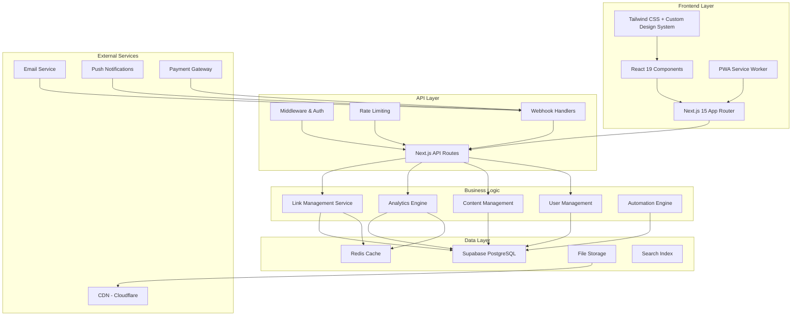

# Design Document - LinkVault Pro

## Overview

LinkVault Pro is a modern, comprehensive affiliate marketing platform designed to provide a premium user experience for affiliate marketers. The platform combines sophisticated link management, advanced analytics, and beautiful product showcases in a self-contained system that doesn't rely on external shopping platform APIs. The design emphasizes modern UI/UX principles, performance, and scalability while maintaining ease of use.

## Architecture

### System Architecture



### Technology Stack

**Frontend:**
- Next.js 15 with App Router for optimal performance and SEO
- React 19 with Server Components for efficient rendering
- Tailwind CSS 4 with custom design system
- Framer Motion for smooth animations
- React Hook Form for form management
- Zustand for state management
- PWA capabilities with service workers

**Backend:**
- Next.js API Routes with TypeScript
- Supabase for database, authentication, and real-time features
- Redis for caching and session management
- Prisma ORM for type-safe database operations
- Zod for runtime validation

**Infrastructure:**
- Vercel for hosting and deployment
- Cloudflare for CDN and security
- Supabase for database and storage
- Upstash Redis for caching
- Resend for email services

## Components and Interfaces

### Design System Components

#### Brand Identity
```typescript
// Brand Configuration
export const brandConfig = {
  name: "LinkVault Pro",
  tagline: "Professional Affiliate Marketing Platform",
  colors: {
    primary: {
      50: "#f0f9ff",
      500: "#3b82f6", // Modern blue
      600: "#2563eb",
      900: "#1e3a8a"
    },
    secondary: {
      50: "#fdf4ff",
      500: "#a855f7", // Purple accent
      600: "#9333ea",
      900: "#581c87"
    },
    success: "#10b981",
    warning: "#f59e0b",
    error: "#ef4444",
    neutral: {
      50: "#f9fafb",
      100: "#f3f4f6",
      500: "#6b7280",
      900: "#111827"
    }
  },
  typography: {
    fontFamily: {
      sans: ["Inter", "system-ui", "sans-serif"],
      mono: ["JetBrains Mono", "monospace"]
    }
  },
  spacing: {
    container: "1200px",
    section: "80px"
  }
}
```

#### Core UI Components

**Button System:**
```typescript
interface ButtonProps {
  variant: 'primary' | 'secondary' | 'outline' | 'ghost' | 'danger'
  size: 'sm' | 'md' | 'lg' | 'xl'
  loading?: boolean
  icon?: ReactNode
  children: ReactNode
}

// Usage examples:
// <Button variant="primary" size="lg">Get Started</Button>
// <Button variant="outline" icon={<PlusIcon />}>Add Product</Button>
```

**Card Components:**
```typescript
interface ProductCardProps {
  product: Product
  variant: 'grid' | 'list' | 'featured'
  showAnalytics?: boolean
  onQuickAction?: (action: string) => void
}

interface AnalyticsCardProps {
  title: string
  value: string | number
  change?: number
  trend: 'up' | 'down' | 'neutral'
  chart?: ReactNode
}
```

**Navigation System:**
```typescript
interface NavigationItem {
  label: string
  href: string
  icon: ReactNode
  badge?: string
  children?: NavigationItem[]
}

// Responsive navigation with mobile-first approach
// Sidebar for desktop, bottom navigation for mobile
```

### Page Layouts

#### Public Pages Layout
```typescript
interface PublicLayoutProps {
  children: ReactNode
  showHero?: boolean
  showNewsletter?: boolean
}

// Features:
// - Sticky header with search
// - Hero section for landing pages
// - Footer with links and newsletter signup
// - Mobile-optimized navigation
```

#### Admin Dashboard Layout
```typescript
interface AdminLayoutProps {
  children: ReactNode
  title: string
  breadcrumbs?: BreadcrumbItem[]
  actions?: ReactNode
}

// Features:
// - Collapsible sidebar navigation
// - Top bar with user menu and notifications
// - Breadcrumb navigation
// - Quick action buttons
```

### Data Models

#### Product Model
```typescript
interface Product {
  id: string
  title: string
  description: string
  shortDescription?: string
  price: {
    current: number
    original?: number
    currency: string
  }
  images: ProductImage[]
  affiliateLinks: AffiliateLink[]
  category: Category
  tags: Tag[]
  status: 'active' | 'inactive' | 'draft' | 'scheduled'
  seo: {
    metaTitle?: string
    metaDescription?: string
    slug: string
  }
  analytics: {
    views: number
    clicks: number
    conversions: number
    revenue: number
  }
  createdAt: Date
  updatedAt: Date
  publishedAt?: Date
}

interface ProductImage {
  id: string
  url: string
  alt: string
  isPrimary: boolean
  order: number
}

interface AffiliateLink {
  id: string
  platform: Platform
  originalUrl: string
  shortenedUrl: string
  commission: number
  isActive: boolean
  priority: number
  analytics: LinkAnalytics
}
```

#### Analytics Model
```typescript
interface LinkAnalytics {
  id: string
  linkId: string
  clicks: ClickEvent[]
  conversions: ConversionEvent[]
  revenue: RevenueEvent[]
  summary: {
    totalClicks: number
    totalConversions: number
    totalRevenue: number
    conversionRate: number
    averageOrderValue: number
  }
}

interface ClickEvent {
  id: string
  timestamp: Date
  userAgent: string
  referrer?: string
  ipAddress: string
  country?: string
  device: 'desktop' | 'mobile' | 'tablet'
  source: 'organic' | 'social' | 'direct' | 'referral'
}

interface ConversionEvent {
  id: string
  clickId: string
  timestamp: Date
  orderValue: number
  commission: number
  currency: string
  status: 'pending' | 'confirmed' | 'cancelled'
}
```

#### User and Authentication Model
```typescript
interface User {
  id: string
  email: string
  role: 'admin' | 'editor' | 'viewer'
  profile: {
    firstName: string
    lastName: string
    avatar?: string
    timezone: string
  }
  preferences: {
    theme: 'light' | 'dark' | 'system'
    language: string
    notifications: NotificationSettings
  }
  createdAt: Date
  lastLoginAt?: Date
}

interface NotificationSettings {
  email: {
    newConversions: boolean
    weeklyReports: boolean
    systemUpdates: boolean
  }
  push: {
    realTimeAlerts: boolean
    dailySummary: boolean
  }
}
```

## Error Handling

### Error Handling Strategy

**Client-Side Error Handling:**
```typescript
// Global error boundary for React components
export class GlobalErrorBoundary extends Component {
  // Catches JavaScript errors anywhere in the child component tree
  // Logs error details and shows user-friendly fallback UI
}

// API error handling with custom hook
export function useApiError() {
  const handleError = (error: ApiError) => {
    // Log error for monitoring
    // Show appropriate user notification
    // Handle specific error types (auth, validation, server)
  }
  return { handleError }
}
```

**Server-Side Error Handling:**
```typescript
// Centralized error handler for API routes
export function withErrorHandler(handler: NextApiHandler) {
  return async (req: NextApiRequest, res: NextApiResponse) => {
    try {
      return await handler(req, res)
    } catch (error) {
      // Log error with context
      // Return appropriate HTTP status and message
      // Handle different error types
    }
  }
}

// Custom error classes
export class ValidationError extends Error {
  constructor(public field: string, message: string) {
    super(message)
    this.name = 'ValidationError'
  }
}

export class AuthenticationError extends Error {
  constructor(message = 'Authentication required') {
    super(message)
    this.name = 'AuthenticationError'
  }
}
```

**Error Monitoring and Logging:**
```typescript
// Error logging service
export class ErrorLogger {
  static log(error: Error, context?: Record<string, any>) {
    // Log to console in development
    // Send to monitoring service in production
    // Include user context, request details, stack trace
  }
  
  static logUserAction(action: string, userId: string, metadata?: any) {
    // Track user actions for debugging and analytics
  }
}
```

## Testing Strategy

### Testing Pyramid

**Unit Tests (70%):**
```typescript
// Component testing with React Testing Library
describe('ProductCard', () => {
  it('displays product information correctly', () => {
    // Test component rendering and props
  })
  
  it('handles click events properly', () => {
    // Test user interactions
  })
})

// Utility function testing
describe('linkShortener', () => {
  it('generates valid short URLs', () => {
    // Test business logic
  })
})
```

**Integration Tests (20%):**
```typescript
// API route testing
describe('/api/products', () => {
  it('creates product with valid data', async () => {
    // Test API endpoints with database
  })
  
  it('returns validation errors for invalid data', async () => {
    // Test error handling
  })
})

// Database integration testing
describe('ProductRepository', () => {
  it('saves and retrieves products correctly', async () => {
    // Test database operations
  })
})
```

**End-to-End Tests (10%):**
```typescript
// Critical user journeys with Playwright
describe('Product Management Flow', () => {
  it('admin can create, edit, and delete products', async () => {
    // Test complete user workflows
  })
})

describe('Link Tracking Flow', () => {
  it('tracks clicks and conversions correctly', async () => {
    // Test analytics functionality
  })
})
```

### Performance Testing

**Load Testing:**
```typescript
// Test API endpoints under load
// Measure response times and throughput
// Identify bottlenecks and optimization opportunities

// Database query performance testing
// Cache effectiveness testing
// CDN and static asset delivery testing
```

**Accessibility Testing:**
```typescript
// Automated accessibility testing with axe-core
// Keyboard navigation testing
// Screen reader compatibility testing
// Color contrast and visual accessibility testing
```

## Performance Optimization

### Frontend Performance

**Code Splitting and Lazy Loading:**
```typescript
// Route-based code splitting
const AdminDashboard = lazy(() => import('./AdminDashboard'))
const ProductCatalog = lazy(() => import('./ProductCatalog'))

// Component-based lazy loading
const AnalyticsChart = lazy(() => import('./AnalyticsChart'))

// Image lazy loading with next/image
<Image
  src={product.image}
  alt={product.title}
  loading="lazy"
  placeholder="blur"
  sizes="(max-width: 768px) 100vw, (max-width: 1200px) 50vw, 33vw"
/>
```

**Caching Strategy:**
```typescript
// Static generation for public pages
export async function generateStaticParams() {
  // Pre-generate popular product pages
}

// Incremental Static Regeneration
export const revalidate = 3600 // Revalidate every hour

// Client-side caching with SWR
const { data, error } = useSWR('/api/products', fetcher, {
  revalidateOnFocus: false,
  revalidateOnReconnect: false,
  refreshInterval: 300000 // 5 minutes
})
```

### Backend Performance

**Database Optimization:**
```sql
-- Optimized indexes for common queries
CREATE INDEX idx_products_category_status ON products(category_id, status);
CREATE INDEX idx_analytics_link_date ON link_analytics(link_id, created_at);
CREATE INDEX idx_clicks_timestamp ON click_events(timestamp DESC);

-- Materialized views for analytics
CREATE MATERIALIZED VIEW daily_analytics AS
SELECT 
  DATE(created_at) as date,
  COUNT(*) as total_clicks,
  COUNT(DISTINCT link_id) as unique_links,
  SUM(revenue) as total_revenue
FROM click_events
GROUP BY DATE(created_at);
```

**API Optimization:**
```typescript
// Response compression
export const config = {
  api: {
    responseLimit: '8mb',
    bodyParser: {
      sizeLimit: '1mb',
    },
  },
}

// Database connection pooling
const db = new Pool({
  connectionString: process.env.DATABASE_URL,
  max: 20,
  idleTimeoutMillis: 30000,
  connectionTimeoutMillis: 2000,
})

// Query optimization with pagination
export async function getProducts(page = 1, limit = 20) {
  const offset = (page - 1) * limit
  return await db.query(`
    SELECT * FROM products 
    WHERE status = 'active'
    ORDER BY created_at DESC
    LIMIT $1 OFFSET $2
  `, [limit, offset])
}
```

## Security Implementation

### Authentication and Authorization

**Multi-Factor Authentication:**
```typescript
// TOTP-based 2FA implementation
export class TwoFactorAuth {
  static generateSecret(userId: string): string {
    // Generate TOTP secret for user
  }
  
  static verifyToken(secret: string, token: string): boolean {
    // Verify TOTP token
  }
  
  static generateBackupCodes(userId: string): string[] {
    // Generate one-time backup codes
  }
}
```

**Role-Based Access Control:**
```typescript
// Permission system
export enum Permission {
  READ_PRODUCTS = 'read:products',
  WRITE_PRODUCTS = 'write:products',
  READ_ANALYTICS = 'read:analytics',
  MANAGE_USERS = 'manage:users',
  ADMIN_ACCESS = 'admin:access'
}

export const rolePermissions = {
  viewer: [Permission.READ_PRODUCTS],
  editor: [Permission.READ_PRODUCTS, Permission.WRITE_PRODUCTS],
  admin: Object.values(Permission)
}

// Middleware for route protection
export function requirePermission(permission: Permission) {
  return (req: NextApiRequest, res: NextApiResponse, next: NextFunction) => {
    // Check user permissions
    // Allow or deny access
  }
}
```

### Data Protection

**Input Validation and Sanitization:**
```typescript
// Zod schemas for validation
export const productSchema = z.object({
  title: z.string().min(1).max(200),
  description: z.string().min(10).max(5000),
  price: z.number().positive(),
  affiliateUrl: z.string().url(),
  category: z.string().uuid()
})

// HTML sanitization
import DOMPurify from 'isomorphic-dompurify'

export function sanitizeHtml(html: string): string {
  return DOMPurify.sanitize(html, {
    ALLOWED_TAGS: ['p', 'br', 'strong', 'em', 'ul', 'ol', 'li'],
    ALLOWED_ATTR: []
  })
}
```

**Rate Limiting:**
```typescript
// API rate limiting
export const rateLimiter = rateLimit({
  windowMs: 15 * 60 * 1000, // 15 minutes
  max: 100, // Limit each IP to 100 requests per windowMs
  message: 'Too many requests from this IP',
  standardHeaders: true,
  legacyHeaders: false,
})

// Specific limits for different endpoints
export const strictRateLimit = rateLimit({
  windowMs: 60 * 1000, // 1 minute
  max: 5, // 5 requests per minute for sensitive operations
})
```

## Mobile-First Design

### Progressive Web App Implementation

**Service Worker:**
```typescript
// Cache strategies for different resource types
const CACHE_NAME = 'linkvault-pro-v1'
const STATIC_CACHE = 'static-v1'
const DYNAMIC_CACHE = 'dynamic-v1'

self.addEventListener('fetch', (event) => {
  if (event.request.url.includes('/api/')) {
    // Network first for API calls
    event.respondWith(networkFirst(event.request))
  } else if (event.request.destination === 'image') {
    // Cache first for images
    event.respondWith(cacheFirst(event.request))
  } else {
    // Stale while revalidate for pages
    event.respondWith(staleWhileRevalidate(event.request))
  }
})
```

**Responsive Design System:**
```typescript
// Breakpoint system
export const breakpoints = {
  sm: '640px',
  md: '768px',
  lg: '1024px',
  xl: '1280px',
  '2xl': '1536px'
}

// Mobile-first component variants
export const cardVariants = {
  mobile: 'p-4 rounded-lg shadow-sm',
  tablet: 'md:p-6 md:rounded-xl md:shadow-md',
  desktop: 'lg:p-8 lg:rounded-2xl lg:shadow-lg'
}
```

**Touch Interactions:**
```typescript
// Gesture handling for mobile
export function useSwipeGesture(onSwipeLeft?: () => void, onSwipeRight?: () => void) {
  const [touchStart, setTouchStart] = useState<number | null>(null)
  const [touchEnd, setTouchEnd] = useState<number | null>(null)
  
  const handleTouchStart = (e: TouchEvent) => {
    setTouchEnd(null)
    setTouchStart(e.targetTouches[0].clientX)
  }
  
  const handleTouchMove = (e: TouchEvent) => {
    setTouchEnd(e.targetTouches[0].clientX)
  }
  
  const handleTouchEnd = () => {
    if (!touchStart || !touchEnd) return
    
    const distance = touchStart - touchEnd
    const isLeftSwipe = distance > 50
    const isRightSwipe = distance < -50
    
    if (isLeftSwipe && onSwipeLeft) onSwipeLeft()
    if (isRightSwipe && onSwipeRight) onSwipeRight()
  }
  
  return { handleTouchStart, handleTouchMove, handleTouchEnd }
}
```

This comprehensive design document provides the foundation for building LinkVault Pro as a modern, scalable, and user-friendly affiliate marketing platform. The architecture emphasizes performance, security, and user experience while maintaining the flexibility to grow and adapt to changing requirements.